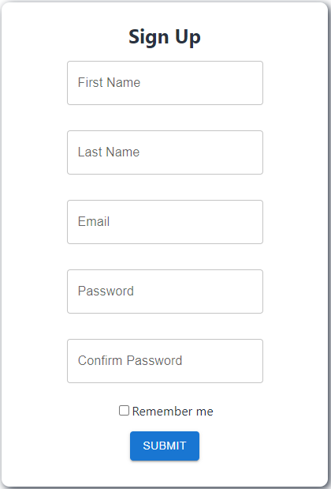
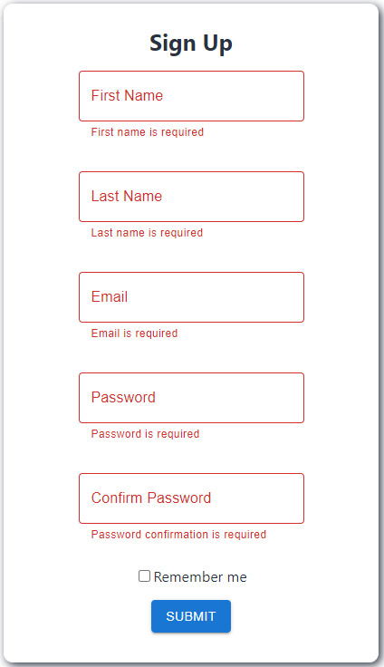
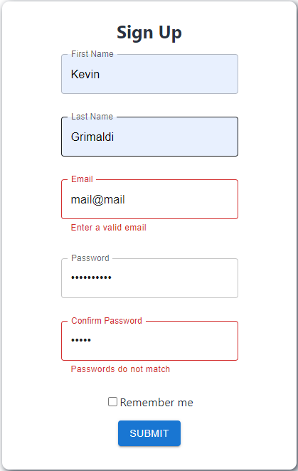
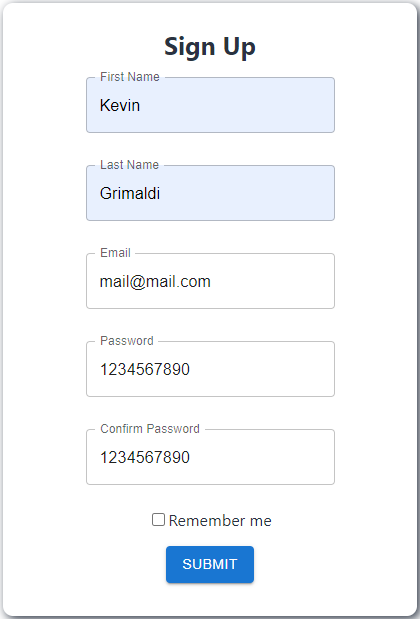
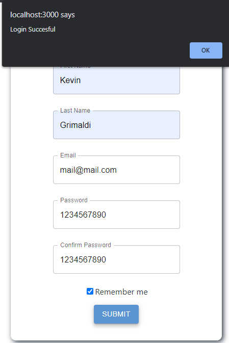
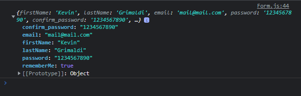

# Sign Up Form: React, Formik, Material UI and Yup
Extra coding challenge from MIT Full Stack Development with MERN. 

It consists in taking one of the examples from the Formik boiler plates and experiment with it. I personally wanted to work with Material UI since it's very popular among the dev community. As well, the package Yup for the validation schema, this allow me to build validations pretty quick. If the form passed the validation it will alert the user "Login Succesful" and log the values into the console (clearly not recommended in a professional set up lol)

## Goals
To create a simple sign up form using:

- React
- Formik
- Yup
- Material UI

### Future Adds 
- Add icon to toggle password visibility instead of double clicking

### Final Look

### Author
Kevin Grimaldi